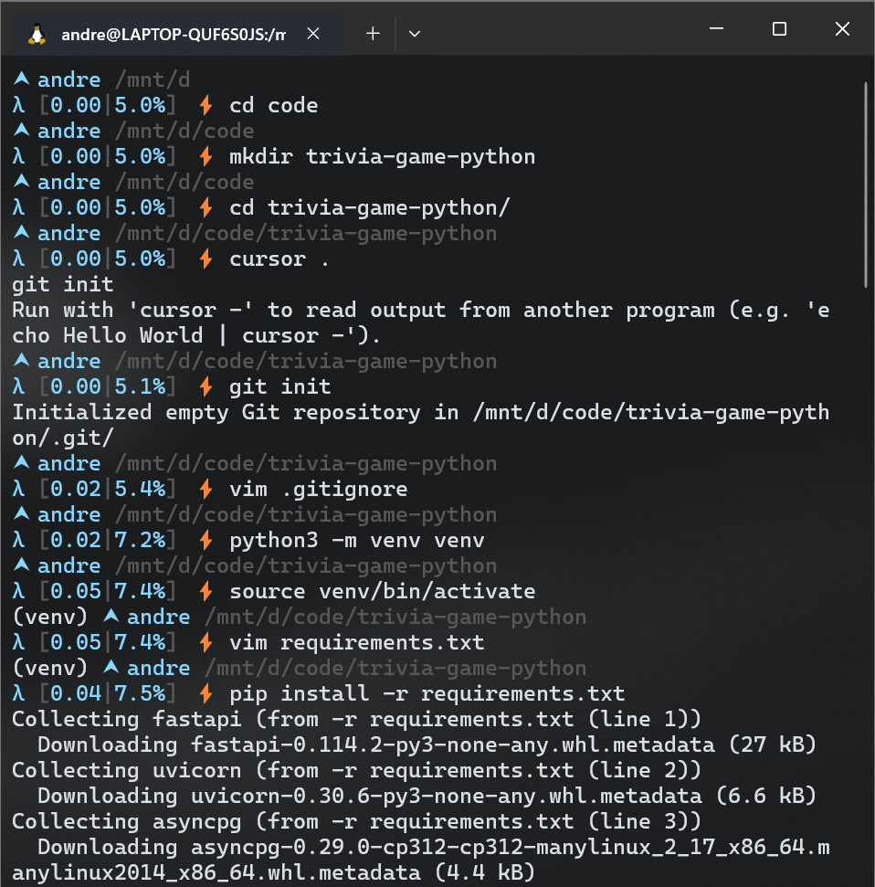
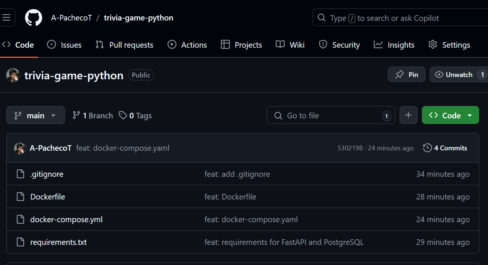
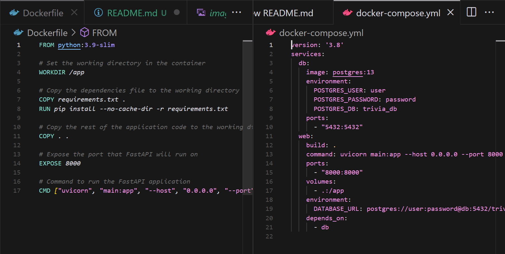

# Documentation of the project

## Step by step process of development

### Sprint 1

#### André

First I initialized the project by creating the respective folder and a github repository.
Then I set up the python environment with the necessary libraries by creating a venv and a requirements.txt file. I also added a .gitignore file to ignore the venv folder.

After the instalation I created the Dockerfile and a basic docker-compose.yml file to containerize the application. I also documented the Dockerfile with comments, describing each instruction.

Each step of the way I committed the changes to the repository and pushed them to the remote repository. Here is the git log of the repository:

